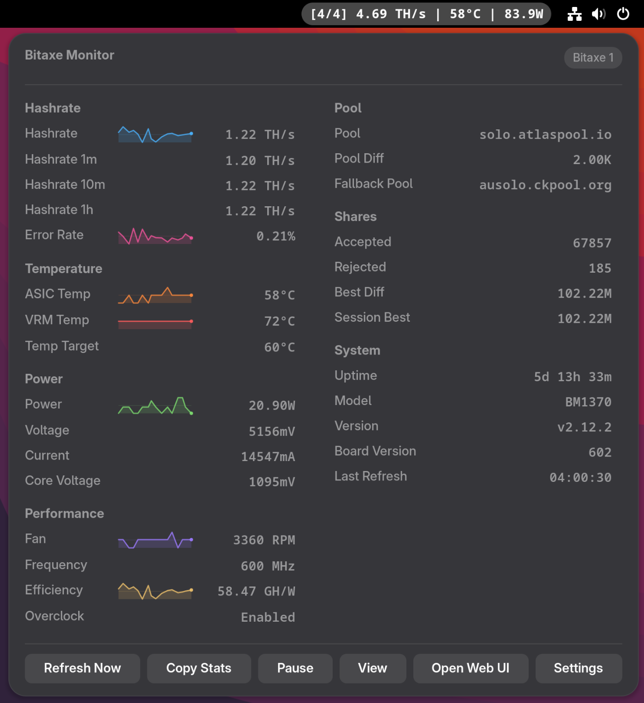

# Bitaxe Monitor - GNOME Extension

A comprehensive GNOME Shell extension for monitoring your Bitaxe mining devices. Track single devices or manage entire farms with real-time stats, sparkline graphs, and customizable displays.

## Screenshot



## Features

### Multi-Device Support
- **Manage unlimited devices** - Add multiple Bitaxe devices with custom nicknames
- **Farm View** - Grid layout showing all devices at once (1-4 columns)
- **Single Device View** - Detailed statistics for individual devices
- **Quick View Switching** - Easy toggle between farm and device views
- **Auto Detection** - Automatically switches to farm view when 2+ devices are configured

### Real-Time Monitoring
- **Panel Display** - Live stats on your GNOME top bar
  - Hashrate (with auto GH/s/TH/s conversion)
  - ASIC and VRM temperatures
  - Power consumption
  - Mining efficiency (GH/W)
  - Fan speed, frequency, shares, and uptime
  - Customizable separators and display format

- **Panel Display Modes**
  - **Auto** - Shows selected device or first device
  - **Selected Device** - Always shows your chosen device
  - **Aggregate** - Total hashrate, power, and average temp across all devices

### Detailed Statistics Popup
- **Hashrate Metrics**
  - Current, 1m, 10m, and 1h averages
  - Error rate percentage
  - Live sparkline graphs

- **Temperature & Cooling**
  - ASIC temperature with sparklines
  - VRM temperature with sparklines
  - Target temperature
  - Fan RPM with sparklines

- **Power & Performance**
  - Power consumption with sparklines
  - Voltage and current
  - Core voltage
  - Voltage rails (when available)
  - Mining efficiency (GH/W) with sparklines

- **Mining Stats**
  - Pool information
  - Pool difficulty
  - Fallback pool
  - Shares accepted/rejected
  - Best difficulty (all-time and session)

- **System Information**
  - Device uptime
  - ASIC model
  - Firmware version
  - Board version
  - Last refresh timestamp

- **Network Details** (toggleable)
  - IP address
  - Wi-Fi SSID
  - Wi-Fi RSSI (signal strength)
  - Free heap memory

### Visual Features
- **Interactive Sparklines** - Real-time history graphs for key metrics
  - Configurable time window (1-60 minutes)
  - 12 color themes (colorful, monochrome, blue, green, amber, purple, red, cyan, orange, pink, lime, teal)
  - Smooth animations and auto-scaling

### Farm View Customization
Configure which stats to display for each device in farm view:
- Hashrate, temperatures (ASIC/VRM), power, voltage
- Mining efficiency, shares, error rate
- Best difficulty, fan speed, frequency
- Mining pool, uptime, device model

### Convenience Features
- **Pause/Resume** - Temporarily stop fetching stats
- **Copy Stats** - Export device or farm stats to clipboard
- **Open Web UI** - Quick access to Bitaxe web interface
- **Refresh Now** - Manual refresh on demand
- **Auto-Refresh** - Configurable interval (1-60 seconds)

## Installation

### Method 1: From GNOME Extensions Website (Recommended)
*Coming soon - pending review*

### Method 2: Using the Install Script
```bash
git clone https://github.com/Gingerbreadfork/bitaxe-monitor-gnome.git
cd bitaxe-monitor-gnome
./install.sh
```

### Method 3: Manual Installation
1. Clone or download this repository:
   ```bash
   git clone https://github.com/Gingerbreadfork/bitaxe-monitor-gnome.git
   cd bitaxe-monitor-gnome
   ```

2. Copy the extension to your GNOME extensions folder:
   ```bash
   mkdir -p ~/.local/share/gnome-shell/extensions/
   cp -r . ~/.local/share/gnome-shell/extensions/bitaxe-monitor@gingerbreadfork.github.io
   ```

3. Compile the settings schema:
   ```bash
   cd ~/.local/share/gnome-shell/extensions/bitaxe-monitor@gingerbreadfork.github.io
   glib-compile-schemas schemas/
   ```

4. Restart GNOME Shell:
   - **On X11**: Press `Alt+F2`, type `r`, and press Enter
   - **On Wayland**: Log out and log back in

5. Enable the extension:
   ```bash
   gnome-extensions enable bitaxe-monitor@gingerbreadfork.github.io
   ```

## Configuration

### Quick Start
1. Open the extension preferences:
   ```bash
   gnome-extensions prefs bitaxe-monitor@gingerbreadfork.github.io
   ```

2. Add your Bitaxe device(s):
   - Click **"Add Device"**
   - Enter a nickname (e.g., "Bitaxe Gamma 1")
   - Enter the IP address or hostname (e.g., `192.168.1.100`)
   - Repeat for additional devices

3. Customize your experience in the **Display** tab

### Settings Overview

#### Devices Tab
- **Add/Remove Devices** - Manage your Bitaxe fleet
- **Device Nicknames** - Custom names for easy identification
- **Default View** - Choose startup view (auto/farm/single)
- **Panel Display Mode** - Select what appears on the panel
- **Farm View Columns** - Grid layout (1-4 columns)
- **Farm Stats** - Toggle individual stats for farm view cards

#### Display Tab
- **Connection Settings** - Refresh interval configuration
- **Panel Display** - Choose which stats appear on the panel
- **Popup Settings** - Enable sparklines, configure window size
- **Sparkline Theme** - Select from 12 color themes
- **Network Info** - Show/hide network details
- **Appearance** - Customize separators and hashrate units

## AxeOS API

This extension uses the AxeOS REST API to fetch stats from your Bitaxe devices:

```
GET http://<bitaxe-ip>/api/system/info
```

The API returns comprehensive system information including:
- Mining statistics (hashrate, shares, difficulty)
- Hardware metrics (temperature, voltage, power)
- Network information
- Device details and firmware version

## Requirements

- **GNOME Shell**: 45, 46, 47, 48, or 49
- **Bitaxe Device**: Running AxeOS firmware
- **Network**: Direct access to your Bitaxe device(s)

### Tested Devices
- ✅ Bitaxe Gamma 602
- ✅ Bitaxe Supra (community confirmed)

## Troubleshooting

### Extension Not Showing Stats

1. **Verify device connectivity:**
   ```bash
   ping <bitaxe-ip>
   curl http://<bitaxe-ip>/api/system/info
   ```

2. **Check device configuration:**
   - Open extension settings
   - Verify IP addresses are correct
   - Ensure devices are powered on and connected

3. **Review GNOME Shell logs:**
   ```bash
   journalctl -f -o cat /usr/bin/gnome-shell | grep bitaxe
   ```

### Extension Not Loading

1. **Verify extension is enabled:**
   ```bash
   gnome-extensions list | grep bitaxe
   gnome-extensions enable bitaxe-monitor@gingerbreadfork.github.io
   ```

2. **Check schema compilation:**
   ```bash
   ls ~/.local/share/gnome-shell/extensions/bitaxe-monitor@gingerbreadfork.github.io/schemas/gschemas.compiled
   ```
   If missing, compile it:
   ```bash
   cd ~/.local/share/gnome-shell/extensions/bitaxe-monitor@gingerbreadfork.github.io
   glib-compile-schemas schemas/
   ```

3. **Look for JavaScript errors:**
   ```bash
   journalctl -f -o cat /usr/bin/gnome-shell
   ```

### Network Issues

If devices show as "Offline" or "Connecting...":
- Ensure Bitaxe web UI is accessible at `http://<bitaxe-ip>`
- Check firewall settings
- Verify same network/VLAN access
- Try increasing refresh interval in settings

### Performance Issues

If the extension feels sluggish with many devices:
- Increase refresh interval (Settings → Display → Connection Settings)
- Reduce farm view columns
- Disable sparklines
- Hide network info section

## Tips & Best Practices

### For Single Device Users
- Panel shows detailed stats by default
- Use sparklines to track performance trends
- Enable all desired panel stats for quick monitoring

### For Multi-Device Farms
- Use descriptive nicknames ("Garage-1", "Office-2", etc.)
- Enable farm view with 2-3 columns for best visibility
- Customize farm stats to show only what matters
- Use aggregate panel mode for total hashrate/power
- Copy stats to clipboard for record keeping

### Display Optimization
- Monochrome sparkline theme for minimal distraction
- 5-minute sparkline window for recent trends
- Custom separator for cleaner panel appearance
- TH/s unit if running high-hashrate devices

## Development

### Project Structure
```
bitaxe-monitor@gingerbreadfork.github.io/
├── extension.js          # Main extension logic
├── prefs.js             # Preferences window
├── metadata.json        # Extension metadata
├── stylesheet.css       # Custom styling
└── schemas/
    └── org.gnome.shell.extensions.bitaxe-monitor.gschema.xml
```

### Building
```bash
./package.sh
```
Creates a distributable ZIP file in `dist/`

## Contributing

Contributions are welcome! Please feel free to submit issues or pull requests.

### Areas for Contribution
- Additional AxeOS API features
- More sparkline themes
- Localization/translations
- Performance optimizations
- Bug fixes and improvements

## License

MIT License - see [LICENSE](LICENSE) file for details

## Credits

- **Built for the Bitaxe community**
- Uses the AxeOS API from [ESP-Miner](https://github.com/bitaxeorg/ESP-Miner)
- Inspired by the innovative Bitaxe hardware project

## Support

- **Issues**: [GitHub Issues](https://github.com/Gingerbreadfork/bitaxe-monitor-gnome/issues)
- **Donations**: PayPal - gingerbreadfork

---

**Happy Mining!** ⛏️
